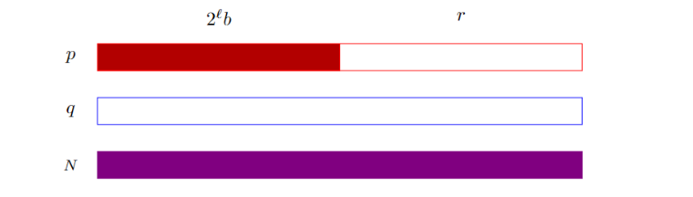

# Coppersmith's attack

# Sơ lược về RSA

RSA thuộc nhóm hệ mã khóa công khai, dựa vào độ khó của bài toán phân tích 1 số ra thừa số nguyên tố (factoring problem). Để tạo cặp khóa Public key và Private key, Alice cần:

- Chọn 2 số nguyên tố lớn p, q với p ≠ q
- Tính n = p.q
- Tính giá trị của phi hàm Euler: `φ(n) = (p-1)(q-1)`
- Chọn 1 số tự nhiên e trong khoảng (1, φ(n)) sao cho `gcd(e, φ(n)) = 1`
- Tính `d = e^(-1) (mod φ(n))` hay `e.d = 1 (mod φ(n))`

Public key sẽ là bộ số `(n, e)`

Private key sẽ là bộ số `(n, d)`

Chúng ta cần giữ private key thật cẩn thận cũng như các số nguyên tố p và q vì từ đó có thể tính toán các khóa rất dễ dàng.

Khi Bob muốn gửi một tin nhắn M cho Alice, Bob chuyển M thành một số m < n theo 1 cách thỏa thuận trước. Bob sẽ tính ra bản mã c từ bản rõ m theo công thức: `c = m^e (mod n)`

Để giải mã, Alice dùng Private Key của mình để tính ngược lại: `m = c^d (mod n)`

Qúa trình giải mã có thể thu được m ban đầu là do

```
	c^d = (m^e)^d = m^(ed) = m (mod n)
```

# ****Stereotyped messages****

Chúng ta đều biết việc tìm nghiệm của 1 đa thức trên trường số nguyên có thể nói là rất dễ dàng. Tuy nhiên, tìm nghiệm của 1 đa thức trong 1 trường hữu hạn là một vấn đề khó để giải quyết:

```python
f(x) = 0 mod N
```

Hãy ký hiệu N là một số nguyên lớn và chúng ta có đa thức nguyên đơn biến `f(x)` với bậc n, tức là:

$$
f(x) = x^N + a_{n-1}x ^ {n-1}+a_{n-2}x ^ {n-2}+...+a_1n+a_0
$$

Hơn nữa, giả sử có một nghiệm nguyên x0 cho phương trình modulo `f(x) ≡ 0 mod N`, `x0 < N^(1/n)`. D. Coppersmith đã chỉ ra cách có thể khôi phục giá trị này trong thời gian đa thức bằng cách sử dụng định lý của Howgrave-Graham:

Định lý: Xét g(x) là đa thức một biến có n đơn thức (đa thức chỉ có một số hạng) và m là một số nguyên dương. Nếu chúng ta có một số giới hạn X và các phương trình sau đúng:

$$
g(x_0) \equiv 0 \mod\ N^m, |x_0| \leq X 
$$

$$
||g(xX)|| < \frac{N^m}{\sqrt{n}}(10)
$$

sau đó g($x_0$) = 0 có nghiệm là một số nguyên.

Lý do sử dụng lattice:

- Nếu chúng ta có một số đa thức có cùng gốc $x_0$  trên $N^m$, chúng ta có thể biểu diễn mỗi đa thức đó dưới dạng một hàng từ một lattice. Sau đó, mỗi tổ hợp tuyến tính của các hàng từ latice sẽ tạo ra một đa thức khác có nghiệm $x_0$.
- Sau đó, bằng cách sử dụng thuật toán LLL trên lattice được thiết kế đặc biệt, trong thời gian đa thức, chúng ta có thể tìm thấy một cơ sở lattice rút gọn khác, sao cho chuẩn của vectơ ngắn nhất từ cơ sở rút gọn sẽ thỏa mãn bất đẳng thức (10) đã nêu ở trên.
- Hãy xác định ngắn nhất vectơ trong cơ sở rút gọn là $v = (v_0,v_1,… ,v_n)$. Ta xây dựng đa thức g(x).

$$
g(x) = v_0+\frac{v_1}{X}x+\frac{v_2}{X^2}x^2+...+\frac{v_n}{X^n}x^n
$$

Vì $g(x)$ nằm trên mạng tinh thể nên chúng ta biết rằng

$$
g(x_0) \equiv 0 \ mod \ N^m \\
$$

$$
|x|  \leq X \\
$$

$$
deg(g) = n \\
$$

$$
||g(xX)|| < \frac{N^m}{\sqrt{n+1}} \\
$$

Theo các kết quả từ định lý trên, chúng ta có thể kết luận rằng g(x) = 0 đúng với các số nguyên.

Ta có thể dễ dàng tạo các đa thức cùng root $x_0$ trên $N^m$. Xét họ các đa thức $g_{i,j}(x)$

$$
g_{i,j}(x_0) \equiv x^j \mod \ N^{m-i} f^i(x) \\
$$

$$
0  \leq i < m\\
$$

$$
0  \leq j < deg(f)\\
$$

Theo thiết kế, tất cả chúng đều có chung gốc $x_0$  trên $N^m$, tức là $g_{i,j}(x0) ≡ 0 \mod\ N^m$. Giá trị của m càng lớn thì ta lập được càng nhiều đa thức. Chúng ta xây dựng càng nhiều đa thức thì mạng càng lớn và thời gian thu gọn mạng sẽ càng lớn. 

Bây giờ, hãy tưởng tượng Eve chặn được một tập hợp các tin nhắn ở dạng rõ ràng giữa Alice và Bob. Các tin nhắn là:

```python
The password for AES usage is: 4{8dXY!
The password for AES usage is: 31kTbwj
The password for AES usage is: 2rr#ETh
···
The password for AES usage is: &H,45zU
```

Sau đó, Alice và Bob bắt đầu trao đổi các tệp được mã hóa bằng AES bằng mật khẩu đã giao tiếp. Nếu nhận được mật khẩu mới, họ sẽ bắt đầu sử dụng ngay lập tức. Tuy nhiên, họ nhận ra rằng điều này hoàn toàn không an toàn và đã tăng cường bảo mật bằng cách sử dụng RSA.

Giả sử Alice muốn gửi một thông điệp chuỗi mã hóa RSA `s` cho Bob. Đầu tiên cô ấy chuyển nó thành số nguyên `m`. Sau đó, cô ấy mã hóa nó bằng cách sử dụng khóa công khai Bob`(N,e)`, tức là $c = (m^e) mod N$ và gửi tin nhắn được mã hóa `c` qua địa chỉ không an toàn.

Khóa công khai của Bob là `(N,3)`, trong đó độ dài bit của N là 512. Ta có thể thấy các thông điệp trên có phần đầu giống hệ nhau chỉ khác 7 bytes cuối hay còn gọi là `stereotyped messages`. Và chúng ta có thể dựa và điều này để khai triển cuộc tấn công. Vậy thông điệp sẽ có cấu trúc như sau,

`S′ = ”The password for AES usage is: C1C2…C7”`

Mục tiêu sẽ là tìm nghiệm x của đa thưc có dạng như sau:

$$
(a+x)^2 -c=0\mod\ N
$$

Ta sẽ tách phần đầu của thông điệp ra và thêm các bytes b’\x00’ vào cuối.

```python
sage: padding = b'\x00'*7
sage: B = b'The password for AES usage is: '
sage: a = B + padding
sage: a
b'The password for AES usage is: \x00\x00\x00\x00\x00\x00\x00'
sage: x = b'\xff'*7
```

Để minh họa cuộc tấn công tốt hơn, chúng ta sẽ xây dựng một đa thức nhiều biến trên vành số nguyên, thay vì một biến.

```python
sage: R.<X,N,a,c> = ZZ[]
```

Bây giờ, chúng ta đã sẵn sàng xây dựng đa thức f(X):

```python
sage: f = (X+a)**3 - c
sage: f
X^3 + 3*X^2*a + 3*X*a^2 + a^3 - c
```

Matrix ta để thực hiện tấn công có dạng như sau

```python
sage: M = matrix([[X^3, 3*X^2*a, 3*X*a^2, a^3-c],[0,N*X^2,0,0],[0,0,N*X,0],[0,0,0,N]])
sage: M
[    X^3 3*X^2*a 3*X*a^2 a^3 - c]
[      0   X^2*N       0       0]
[      0       0     X*N       0]
[      0       0       0       N]
```

Lattice của chúng tôi đã sẵn sàng. Chúng ta có thể bắt đầu thuật toán LLL:

```python
sage: B = M.LLL()
```

Vectơ ngắn nhất B[0] trong cơ sở rút gọn của chúng ta chứa các hệ số mà chúng ta cần để xây dựng đa thức g trên vành hữu tỉ. Chúng ta có thể dễ dàng xây dựng nó bằng cách sử dụng SageMath

```python
sage: R.<x> = QQ[]
sage: Q = sum([B[0][i]*(x**i)/(X_const**i) for i in range(4)])
```

Theo định lý đã nêu, đa thức cuối cùng phải có nghiệm là các số nguyên. Và thực sự như vậy:

```python
sage: sol = Q.roots(ring=ZZ)[0][0]
sage: type(sol)
<type ’sage.rings.integer.Integer’>
```

Như vậy sol chính là giá trị mà ta cần tìm. 

Vì bài toán ví dụ ờ trên chưa có các dữ kiện cụ thể như `c` và `N` ta sẽ cùng làm 1 bài CTF khó hơn 1 tí để hiểu rõ hơn về cách vận hành của CopperSmith attack.

## ****PapaRSA (UIUCTF2017) — CopperSmith Attack on partly-known encrypted message****

source:

```python
#! /usr/bin/env python2
from Crypto.PublicKey import RSA
key = RSA.generate(4096, e=5)
msg = "this challenge was supposed to be babyrsa but i screwed up and now i have to redo the challenge.\nhopefully this challenge proves to be more worthy of 250 points compared to the 200 points i gave out for babyrsa :D :D :D\nyour super secret flag is: XXXXXXXXXXXXXXXXXXXXXXXXXXXXXXXXXXXXXXXXXXXXXXXXXXXXXXXXXXXX\nyou know what i'm going to add an extra line here just to make your life miserable so deal with it"
m = int(msg.encode("hex"), 16)
c = pow(m, key.e, key.n)
f = open("paparsa.txt", "w")
print >> f, "n = {}".format(key.n)
print >> f, "e = {}".format(key.e)
print >> f, "c = {}".format(c)
n = 805467500635696403604126524373650578882729068725582344971555936471728279008969317394226798274039587275908735628164913963756789131471531490012281262137708844664619411648776174742900969650281132608104486439462068493207388096754400356209191212924158917441463852311090597438686723680422989566039830705971272945580630621308622704812919416445637277433384864510484266136345300166188170847768250622904194100556098235897898548354386415341541887443486684297114240486341073977172459860420916964212739802004276614553755113124726331629822694410052832980560107812738167277181748569891715410067156205497753620739994002924247168259596220654379789860120944816884358006621854492232604827642867109476922149510767118658715534476782931763110787389666428593557178061972898056782926023179701767472969849999844288795597293792471883445525249025377326859655523448211020675915933552601140243332965620235850177872856558184848182439374292376522160931072677877590262080551636962148104050583711183119856867201924407132152091888936970437318064654447142605921825771487108398034919404885812834444299826080204996660391375038388918601615609593999711720104533648851576138805705999947802739408729788376315233147532770988216608571607302006681600662261521288802804512781133
e = 5
c = 321344338551168130701947757669249162791535374419225256466002854387287697945811581844875867845545337575193797350159207497966826027124926618458827324785590115214765980153475875175895244152171945352397663605222668892070894285036685408001675776259216704639659684767335997326195127379070104670798191048101430782486785148455557975065509824478935393935463232461294974471055239751453456270779997852527271795223623224696998441762750417393944955667837832299195592347653873362173157136283926817115042942127695355760288879165245940595259284499711202547364332122472169897570069773912201877037737474884548477516093671861643329899650704311880900221217905929830674467383904928054908475945599046498840246878554674443087280023564313470872269644230953001876937807402083390603760508851259383686896871724061532464374712413952574633098739843484563001012414107193262431117290853995664646176812763789444386869148000606985026530596652927567162641583951775993815884965569050328445927871220492529331846189285588168127051152438658813934744257031316581112434690871286836998078235766836485498780504037745116357109237384369621143931229920342036890494878183569174869563857473355851368119174926388706612127773670862261189669510108216517652686402185979222505401328291
```

out put:

```python
this challenge was supposed to be babyrsa but i screwed up and now i have to redo the challenge.\nhopefully this challenge proves to be more worthy of 250 points compared to the 200 points i gave out for babyrsa :D :D :D\nyour super secret flag is: XXXXXXXXXXXXXXXXXXXXXXXXXXXXXXXXXXXXXXXXXXXXXXXXXXXXXXXXXXXX\nyou know what i'm going to add an extra line here just to make your life miserable so deal with it
```

Như đã nêu ở trên, ta có:

```python
m^e mod N = c
-> m^e - c = 0 mod n
```

Vậy f(x) của chúng ta sẽ là:

```python
f(x) = m^e - c
```

chúng ta đã biết được 1 phần của msg nên phần chứ biết sẽ đóng vai trò x (M là phần đã biết)

```python
f(x) = (M + x)^e - c
```

Đầu tiên ta cần chuyển ‘XXXX…’ thành bytes b‘\x00…’

```python
sage: msg = "this challenge was supposed to be babyrsa but i screwed up and now i have to redo the challenge.\nhopefully this challenge proves to be more worthy of 250 points compared to the 200 points i gave
....: out for babyrsa :D :D :D\nyour super secret flag is: XXXXXXXXXXXXXXXXXXXXXXXXXXXXXXXXXXXXXXXXXXXXXXXXXXXXXXXXXXXX\nyou know what i'm going to add an extra line here just to make your life miserable so de
....: al with it"
sage: msg = msg.encode()
sage: msg = msg.replace(b"X",b"\x00")
sage: msg
b"this challenge was supposed to be babyrsa but i screwed up and now i have to redo the challenge.\nhopefully this challenge proves to be more worthy of 250 points compared to the 200 points i gave out for babyrsa :D :D :D\nyour super secret flag is: \x00\x00\x00\x00\x00\x00\x00\x00\x00\x00\x00\x00\x00\x00\x00\x00\x00\x00\x00\x00\x00\x00\x00\x00\x00\x00\x00\x00\x00\x00\x00\x00\x00\x00\x00\x00\x00\x00\x00\x00\x00\x00\x00\x00\x00\x00\x00\x00\x00\x00\x00\x00\x00\x00\x00\x00\x00\x00\x00\x00\nyou know what i'm going to add an extra line here just to make your life miserable so deal with it"
```

Ngay sau “XXX”, có 98 ký tự khác, 1 byte null, vì vậy chúng ta có 99. Nếu cờ là m, tin nhắn ban đầu sẽ là `M = msg + (2^8)^99*m`

có thể hiểu đơn giản qua vd sau:

**`9999955599999 = 9999900099999 + 555*(10^5)`**

Thay vì dựng ma trận, ta sẽ tận dụng hàm small_roots của  sage cho f(x):

```python
sage: msg = bytes_to_long(msg)
sage: P.<x> = PolynomialRing(Zmod(n))
sage: f = (msg + ((2^8)^99)*x)^5 - c
sage: f = f.monic()
sage: f.small_roots(epsilon=1/20))
[1248984295175060908103635259382502837476510996520290172164518365629374785269360163379181788573297776902028363990820288716208404068947393627909757]
sage: a = 1248984295175060908103635259382502837476510996520290172164518365629374785269360163379181788573297776902028363990820288716208404068947393627909757
sage: long_to_bytes(a)
b'flag{bu7_0N_4_w3Dn3sdAy_iN_a_c4f3_i_waTcH3dD_17_6eg1n_aga1n}'
```

Lưu ý ở challenge này ta phải bổ sung tham số epsilon cho hàm small_roots để tăng giới hạn tìm kiếm thì mới thu được kết quả.

# **Factoring with high bits known**

Trong phần này, ta sử dụng các lattice để phân tích factor N nếu biết một phần lớn các bit liền kề của một trong các hệ số (không làm mất tính tổng quát).



Vấn đề cần giải quyết: Factor N = qp khi đã biết các `most significant bits` liền kề của p 

**Problem setup**: Đặt N = pq là một RSA modulus với p và q có kích thước bằng nhau. Chọn một ví dụ với các số đủ nhỏ để vừa trên trang, chúng tôi có RSA modulus 240 bit

```python
N = 0x4d14933399708b4a5276373cb5b756f312f023c43d60b323ba24cee670f5
```

Giả sử chúng ta biết một phần lớn liền kề của các bit quan trọng nhất b của p, sao cho p = a + r, trong đó chúng ta không biết r nhưng biết giá trị $a = 2^l*b$. Ở đây $l = 30$ là số bit chưa biết, hoặc là số lần dịch trái dịch chuyển trái của các bit đã biết. Trong ví dụ của chúng tôi, chúng tôi có

```python
a = 0x68323401cb3a10959e7bfdc0000000
```

Đặt vấn đề dưới dạng tìm nghiệm của đa thức. Cho $f(x) = a\;+\;x$. Chúng ta biết rằng có một số giá trị r sao cho $f(r) = p ≡ 0 \;mod\; p$. Chúng ta không biết p, nhưng biết rằng p là nhân tử của N và N đã biết.

Biết rằng r chưa biết là khá nhỏ, và cụ thể là |r| < R đối với R bị ràng buộc nào đó đã biết. Trong bài toán này, `R = 2^30`

```python
sage: N = 0x4d14933399708b4a5276373cb5b756f312f023c43d60b323ba24cee670f5
sage: a = 0x68323401cb3a10959e7bfdc0000000
sage: R = 2^30
sage: M = matrix([[R^2, 2*R*a, a^2], [0, R, a], [0, 0, N]])
```

Ma trận (M) để giải quyết bài toán sẽ có dạng như sau:

```python
[  R^2 2*a*R   a^2]
[    0     R     a]
[    0     0     N]
```

Sau đó dùng LLL trên lattice M. Đặt $v = (v_2R^2,\; v_1R,\; v0)$ là vectơ ngắn nhất trong cơ sở rút gọn. Trong ví dụ trên, ta nhận được vectơ.

$v =(−0x0x17213d8bc94R^2, \;−0x1d861360160a4f86181R, \;0xf9decdc1447c3f3843819a5d)$

Trích xuất thành một đa thức và tìm nghiệm. Ta tạo thành một đa thức $f(x) =v_2x^2 + v_1x + v_0$. 

Sau đó chúng ta có thể tính nghiệm của f(x). Trong ví dụ này, f có một nghiệm nguyên là r = `0x873209`. Đê chắc chắn, ta có thể xây dựng lại a + r và xác minh rằng gcd(a + r,N) là a + r

Cấu trúc ma trận 3 × 3 này phù hợp với mọi $|r| < p^{1/3}$ và trực tiếp mở rộng quy mô khi p tăng. Trong ví dụ của chúng tôi, ta đã chọn p và q sao cho chúng có 120 bit và r có 30 bit. Tuy nhiên, cấu trúc tương tự này sẽ hoạt động để khôi phục 170 bit từ hệ số 512 bit của RSA modulus 1024 bit hoặc 341 bit từ hệ số 1024 bit của RSA modulus 2048 bit. 

Code hoàn chỉnh như sau:

```python
sage: N = 0x4d14933399708b4a5276373cb5b756f312f023c43d60b323ba24cee670f5
sage: a = 0x68323401cb3a10959e7bfdc0000000
sage: R = 2^30
sage: M = matrix([[R^2, 2*R*a, a^2], [0, R, a], [0, 0, N]])
sage: B = M.LLL()
sage: P.<x> = PolynomialRing(Zmod(N))
sage: f = B[0][0]*x^2/R^2+B[0][1]*x/R+B[0][2]
sage: f = f.monic()
sage: r = f.small_roots()[0]
sage: r
[8860169]
sage: gcd(a+r, N) == (a+r)
True
```

CTF challenge về hình thức tấn công trên:

## HCMUS_QUALS: Sneak peek

```python
from Crypto.Util.number import getPrime, bytes_to_long as b2l

FLAG = b2l(b'HMCSU-CFT{SO YOU THINK THIS FLAG IS REAL\xff}')

p = getPrime(512)
q = getPrime(512)

n = p * q
peek = p >> 240

print(n)
print(bin(peek))
print(bin(p))
"""
n = 137695652953436635868173236797773337408441001182675256086214756367750388214098882698624844625677992374523583895607386174643756159168603070583418054134776836804709359451133350283742854338177917816199855370966725059377660312824879861277400624102267119229693994595857701696025366109135127015217981691938713787569
peek = 6745414226866166172286907691060333580739794735754141517928503510445368134531623057
enc_flag = 60939585660386801273264345336943282595466297131309357817378708003135300231065734017829038358019271553508356563122851120615655640023951268162873980957560729424913748657116293860815453225453706274388027182906741605930908510329721874004000783548599414462355143868922204060850666210978837231187722295496753756990
"""
```

### Solution

Ta sẽ dựng $f(x) = leak << 240 + x$ 

Thay vì sử dụng lattice như trên thì bài này sẽ cung cấp thêm 1 cách làm mới là sử dụng `small_roots` của sage.

```python
sage: N = 13769565295343663586817323679777333740844100118267525608621475636775038821409888269862484462....: 567799237452358389560738617464375615916860307058341805413477683680470935945113335028374285433817....: 791781619985537096672505937766031282487986127740062410226711922969399459585770169602536610913512....: 7015217981691938713787569
....: e = 65537
....:
....: leak = 6745414226866166172286907691060333580739794735754141517928503510445368134531623057
sage: P.<x> = PolynomialRing(Zmod(n))
sage: f = x + (leak << 240)
sage: f.small_roots(X=2^240, beta = 0.2, epsilon=1/200)
[1068145393984575104564040557511108681247660129429767665495025468528378439]
sage: p = int(leak << 240) + 1068145393984575104564040557511108681247660129429767665495025468528378439
sage: p
11918115327452840353182098808413773161526179795462517390630981598332371960071647247964792629975772037391372830863318764111397518777467149584983329384153671
sage: q = N // p
sage: p
11918115327452840353182098808413773161526179795462517390630981598332371960071647247964792629975772037391372830863318764111397518777467149584983329384153671
```

Giaỉ thích: `f.small_roots(X=2^240, beta = 0.2, epsilon=1/200)`

Tìm x sao cho:

$$
x < X,  \\
$$

$$
x > N^{0.2} \\
$$

Và giảm nhỏ `epsilon` để tăng giới hạn tìm kiếm của thuật toán.

Dùng p và q đã tìm được để giải mã flag:

```python
from Crypto.Util.number import long_to_bytes

N = 137695652953436635868173236797773337408441001182675256086214756367750388214098882698624844625677992374523583895607386174643756159168603070583418054134776836804709359451133350283742854338177917816199855370966725059377660312824879861277400624102267119229693994595857701696025366109135127015217981691938713787569
e = 65537
c = 60939585660386801273264345336943282595466297131309357817378708003135300231065734017829038358019271553508356563122851120615655640023951268162873980957560729424913748657116293860815453225453706274388027182906741605930908510329721874004000783548599414462355143868922204060850666210978837231187722295496753756990
leak = 6745414226866166172286907691060333580739794735754141517928503510445368134531623057

p = 11918115327452840353182098808413773161526179795462517390630981598332371960071647247964792629975772037391372830863318764111397518777467149584983329384153671
q = 11553475459014976853548967468638172498419788021623802974508623943234306723640407777491109179572222419366963601151005006800409206893050401617294252857306439
phi = (p-1)*(q-1)

print(long_to_bytes(pow(c, pow(e, -1, phi), N)))
#b'HCMUS-CTF{d0nt_b3_4n_3XhiB1ti0ni5t_0r_y0uLL_g3t_eXp0s3d}'
```

Reference:

[https://hal.science/hal-03045663/document](https://hal.science/hal-03045663/document)

[https://latticehacks.cr.yp.to/rsa.html](https://latticehacks.cr.yp.to/rsa.html)

[https://www.jianshu.com/p/d8d2ce53041b](https://www.jianshu.com/p/d8d2ce53041b)

[https://www.cryptool.org/download/ctb/CTB-Chapter_Lattice-Introduction_en.pdf](https://www.cryptool.org/download/ctb/CTB-Chapter_Lattice-Introduction_en.pdf)
